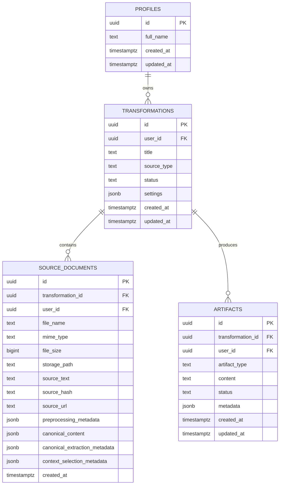

# DocCraft

DocCraft is an AI-powered document transformation platform that converts multimodal source files (PDF, DOCX, Markdown, Text, Image, and URL) into structured, audience-specific communication deliverables using client-side preprocessing, semantic extraction, output-aware context reduction, and Google Gemini 3.8 Flash.

[](https://react.dev/)
[](https://www.typescriptlang.org/)
[](https://vitejs.dev/)
[](https://tailwindcss.com/)
[](https://supabase.com/)
[](https://ai.google.dev/)

---

## Table of Contents

- [Overview](#overview)
- [Key Features](#key-features)
- [System Architecture](#system-architecture)
- [Application Workflow](#application-workflow)
- [AI Architecture & Multi-Phase Pipeline](#ai-architecture--multi-phase-pipeline)
- [Document Processing Pipeline](#document-processing-pipeline)
- [Database Schema & Security (RLS)](#database-schema--security-rls)
- [Storage Architecture](#storage-architecture)
- [Authentication Flow](#authentication-flow)
- [Export & Deliverables System](#export--deliverables-system)
- [Technology Stack](#technology-stack)
- [Project Structure](#project-structure)
- [Getting Started](#getting-started)
  - [Prerequisites](#prerequisites)
  - [Installation](#installation)
  - [Environment Variables](#environment-variables)
  - [Local Development](#local-development)
  - [Production Build](#production-build)
- [Supabase Setup & Edge Function Deployment](#supabase-setup--edge-function-deployment)
- [Deployment Configuration](#deployment-configuration)
  - [Firebase Hosting](#firebase-hosting)
  - [Vercel Deployment](#vercel-deployment)
- [Development Scripts](#development-scripts)
- [Deployment Architecture](#deployment-architecture)
- [Performance & Optimizations](#performance--optimizations)
- [Limitations](#limitations)
- [Future Improvements](#future-improvements)
- [Contributing](#contributing)
- [License](#license)

---

## Overview

Modern technical reports, security advisories, business memoranda, and whitepapers contain dense, multimodal information that must be tailored for different audiences. Reformatting this information manually into executive summaries, technical advisories, presentation outlines, social posts, infographics, and video packages is repetitive and time-consuming.

**DocCraft** solves this by establishing an end-to-end, multi-phase transformation pipeline:
1. **Ingests & Normalizes** diverse formats directly in the client (`pdfjs-dist`, `mammoth`, Web Crypto SHA-256).
2. **Extracts Canonical Semantics** into an intermediate knowledge graph (facts, metrics, dates, entities, actions, tables, quotes).
3. **Applies Output-Aware Context Pruning** to strip irrelevant data per deliverable type, reducing prompt payload size before AI invocation.
4. **Dispatches Securely to Gemini 3.8 Flash** through serverless Supabase Edge Functions with zero browser-exposed API keys.
5. **Provides Interactive Review & Export** featuring in-app human approval, editing, Markdown, plain text, JSON, CSV tables, PNG screenshots, and formatted print stylesheets.

---

## Key Features

### Multimodal Document Ingestion & Preprocessing
* **PDF Extraction (`pdfjs-dist`)**: Client-side per-page text extraction, page markers, and scanned document detection (`< 50 characters/page`).
* **DOCX Parsing (`mammoth`)**: Conversion of Word documents into structured Markdown and clean text.
* **Plain Text & Markdown Ingestion**: Unicode NFKC normalization, whitespace sanitization, control character stripping, and structural heading parsing.
* **Deterministic Signal Detection**: Regex-based extraction of currencies, percentages, dates, CVE identifiers, and markdown tables.
* **Multimodal Fallback**: Automatic private storage retention and Gemini native multimodal processing for images (PNG, JPG, WEBP) and scanned PDFs.
* **Cryptographic Provenance**: Client-side Web Crypto SHA-256 fingerprinting for tamper-proofing and data provenance verification.

### Multi-Phase AI Transformation Engine
* **Model Used**: Google Gemini 3.8 Flash (`gemini-3.8-flash`).
* **Canonical Content Extraction (Phase B)**: Intermediate representation isolating verified facts, entities, numerical figures, actions, dates, and tables.
* **Output-Aware Context Selection (Phase C)**: Deterministic pruning engine that filters context fields per deliverable type (e.g., removing tables for tweets, prioritizing CVEs and mitigation steps for advisories).
* **Strict JSON Output Schemas**: Generation of structured, strongly typed artifacts with automatic fallback normalization.

### 7 Specialized Deliverable Renderers
* **Executive Summary**: Strategic decision brief with synthesis confidence ratings, key findings, and recommended actions.
* **Technical Advisory**: Structured security memo with severity ratings (Critical, High, Medium, Low), affected systems, indicators of compromise (IOCs), and remediation workflows.
* **LinkedIn Post**: Professional thought-leadership post with business takeaways, hooks, and hashtags.
* **X / Twitter Thread**: 280-character constrained thread with headline hooks, bulleted points, and calls to action.
* **Infographic Specification**: Visual poster spec with metric cards, sequential process steps, and callout banners.
* **Presentation Outline**: 16:9 interactive slide deck viewer with slide titles, bullet points, speaker notes, and visual cues.
* **Video Storyboard Script**: Production-ready storyboard with scene pacing, runtime calculations, visual descriptions, voiceover scripts, and on-screen graphics.

### Deliverable Management & Export Engine
* **Human-in-the-Loop Review**: Real-time deliverable editing, approval, and rejection workflow with persistent database state.
* **Multi-Format Downloads**: Markdown (`.md`) with provenance headers, Plain Text (`.txt`), JSON (`.json`), CSV (`.csv`) for extracted tables.
* **Visual Canvas to PNG (`html-to-image`)**: High-resolution client-side screenshot export of infographic and slide canvases.
* **Print / PDF Generation**: Clean print stylesheets rendered through sandboxed iframes.
* **Sequential Batch Export**: One-click sequential download runner with progress tracking.

---

## System Architecture

```mermaid
flowchart TD
    subgraph Client["Client Browser (React 19 + Vite 8)"]
        UI[DocCraft UI / Tailwind CSS]
        AUTH_HOOK[useAuth Hook / Context]
        ROUTER[React Router DOM v7]

        subgraph Preprocessing["Client-side Preprocessing Engine"]
            PDF_PARSER["pdfjs-dist Parser"]
            DOCX_PARSER["Mammoth DOCX Parser"]
            TEXT_NORM["Unicode & Whitespace Normalizer"]
            SIGNAL_DETECTOR["Deterministic Signal Extractor"]
            SHA256_ENGINE["Web Crypto SHA-256 Fingerprinter"]
        end

        subgraph Reduction["Phase C Context Selector"]
            SELECTOR["Deterministic Output-Aware Selector"]
            TOKEN_BUDGET["Token Budget Enforcement"]
        end

        subgraph ExportLayer["Export & Renderer Engine"]
            RENDERERS["7 Custom Output Renderers"]
            IMG_EXPORT["html-to-image PNG Exporter"]
            FILE_EXPORT["Blob & File Downloader"]
            PRINT_ENGINE["Sandboxed Print/PDF Engine"]
        end
    end

    subgraph SupabaseBackend["Supabase Cloud Platform"]
        SB_AUTH["Supabase Auth (JWT Sessions)"]
        SB_STORAGE["Supabase Storage ('source-files' bucket)"]
        SB_DB[("PostgreSQL Database (RLS Enforced)")]
        EDGE_FN["Supabase Edge Functions ('ai-generate')"]
    end

    subgraph AIProvider["Google AI"]
        GEMINI["Gemini 3.8 Flash API (generateContent)"]
    end

    UI --> AUTH_HOOK --> SB_AUTH
    UI --> Preprocessing
    PDF_PARSER --> TEXT_NORM
    DOCX_PARSER --> TEXT_NORM
    TEXT_NORM --> SIGNAL_DETECTOR --> SHA256_ENGINE
    SHA256_ENGINE --> SELECTOR --> TOKEN_BUDGET

    UI --> |Upload Raw/Fallback File| SB_STORAGE
    UI --> |Persist Records & Artifacts| SB_DB
    UI --> |Invoke AI Transformation| EDGE_FN

    EDGE_FN --> |Verify JWT / User Session| SB_AUTH
    EDGE_FN --> |Fetch Fallback Multimodal File| SB_STORAGE
    EDGE_FN --> |REST POST generateContent (GEMINI_API_KEY)| GEMINI
    GEMINI --> |Structured JSON Response| EDGE_FN
    EDGE_FN --> |Validated Artifact Payload| UI

    UI --> RENDERERS
    RENDERERS --> ExportLayer
```

---

## Application Workflow

```mermaid
flowchart LR
    A["1. Ingest Source<br/>(PDF, DOCX, TXT, Img, URL)"] --> B["2. Client Preprocessing<br/>(Extract, Normalize, SHA-256)"]
    B --> C["3. Canonical Extraction<br/>(Facts, Metrics, Entities, Actions)"]
    C --> D["4. Context Reduction<br/>(Output-Aware Pruning)"]
    D --> E["5. Gemini 3.8 Flash<br/>(Via Supabase Edge Function)"]
    E --> F["6. Output Validation<br/>(Schema Verification)"]
    F --> G["7. Review & Edit<br/>(Approve, Reject, Modify)"]
    G --> H["8. Export & Download<br/>(MD, TXT, JSON, CSV, PNG, Print)"]
```



1. **Ingest Source**: User provides plain text, pastes a URL, or attaches a PDF, DOCX, or image file.
2. **Client Preprocessing**: The browser extracts text via `pdfjs-dist` or `mammoth`, sanitizes Unicode and whitespace, computes a SHA-256 fingerprint, and detects scanned documents.
3. **Canonical Extraction**: Identifies key facts, numeric figures, entities, actions, dates, tables, and quotes.
4. **Context Reduction**: Filters the extracted knowledge graph into tailored context slices based on target deliverable formats.
5. **Gemini 3.8 Flash Generation**: The client invokes the `ai-generate` Edge Function with the reduced context, where Gemini generates structured deliverable outputs.
6. **Output Validation**: Deliverable schemas are verified and saved to the PostgreSQL `artifacts` table under Row-Level Security.
7. **Review & Edit**: Users preview outputs in specialized renderers, modify titles or markdown content, and approve/reject deliverables.
8. **Export & Download**: Deliverables are exported to Markdown, TXT, JSON, CSV, PNG, or print-ready PDFs.

---

## AI Architecture & Multi-Phase Pipeline

### Architecture Overview

```text
Browser Client
   │
   ├─ 1. Preprocesses document locally (pdfjs-dist / mammoth / regex)
   ├─ 2. Computes SHA-256 hash using Web Crypto API
   ├─ 3. Builds Canonical Representation
   ├─ 4. Slices context per requested output type (Phase C reduction)
   │
   ▼
Supabase Edge Function (`ai-generate`)
   │
   ├─ 5. Validates user JWT authentication header
   ├─ 6. Reads `GEMINI_API_KEY` from Supabase Edge Secrets
   ├─ 7. Assembles system prompt with output schemas and context slices
   ├─ 8. Calls Gemini API: `https://generativelanguage.googleapis.com/v1beta/models/gemini-3.8-flash:generateContent`
   │
   ▼
Gemini 3.8 Flash Engine
   │
   └─ 9. Generates structured JSON containing analysis and artifacts
   │
   ▼
Browser Client
   │
   ├─ 10. Normalizes artifact payloads defensively
   ├─ 11. Stores artifacts into Supabase PostgreSQL database
   └─ 12. Renders dynamic deliverable previews in the UI
```

### Context Selection Policies (Phase C Engine)

| Deliverable Type | Default Token Budget | Retained Fields | Pruned / Excluded Fields | Policy Rationale |
| :--- | :--- | :--- | :--- | :--- |
| **`x_post`** | 3,000 | Top facts (high), top 4 figures, critical action, 2 dates | Tables, quotes, sections, locations, low-priority facts | Context pruning tailored for 280-character thread brevity. |
| **`linkedin_post`** | 4,000 | High/medium facts, key metrics, top 4 entities, top 2 quotes, top 3 actions | Tables, raw sections, low-priority facts | Preserves industry takeaways, metrics, and leadership takeaways. |
| **`infographic`** | 5,000 | All numerical figures, structured tables, quantitative facts, process steps | Narrative quotes, long prose sections, source references | Prioritizes structured data points and metrics for visual layout. |
| **`advisory`** | 8,000 | All verified facts, security actions, figures, affected entities, dates, tables | Low-priority actions, casual prose | Preserves technical scope, CVE identifiers, and remediation deadlines. |
| **`executive_summary`** | 5,000 | High/medium facts, key figures, critical/high actions, entities, dates | Low-priority facts, raw sections, exhaustive footnotes | Distills macro impact, KPIs, and executive decisions. |
| **`presentation`** | 10,000 | Slide sections, facts, all figures, events, tables, speaker quotes | Low-priority noise | Retains slide-level narrative flow, milestones, and talking points. |
| **`video`** | 8,000 | Timeline events, dates, facts, figures, locations, critical actions | Raw tables, verbose footnotes | Focuses on visual hooks, timeline events, and soundbites for storyboards. |

---

## Document Processing Pipeline

| Modality | Ingestion Layer | Parsing Engine | Fallback Behavior |
| :--- | :--- | :--- | :--- |
| **PDF (`.pdf`)** | Client Browser | `pdfjs-dist` (Page-by-page text layer extraction) | If character density `< 50 chars/page` (scanned PDF), uploads raw file to Supabase Storage and routes via multimodal pipeline. |
| **DOCX (`.docx`)** | Client Browser | `mammoth` (Extracts raw text and converts document tree to Markdown) | If conversion yields empty text, falls back to direct text input modal. |
| **Markdown (`.md`)** | Client Browser | Custom Markdown Parser + Unicode Normalizer | Client-side sanitization. |
| **Plain Text (`.txt`)** | Client Browser | String Normalization & Whitespace Cleanup | Direct in-memory parsing. |
| **Images (`.png`, `.jpg`, `.webp`)** | Client Browser | Raw upload to private Supabase Storage bucket | Direct native multimodal processing in Gemini 3.8 Flash via Base64/Storage URI. |
| **Direct URL Ingestion** | Client Browser | Ingestion and preprocessing pipeline | Sanitized and normalized before extraction. |

---

## Database Schema & Security (RLS)

The database is built on **PostgreSQL** hosted on **Supabase**, with **Row-Level Security (RLS)** enabled on every table to isolate user data.



### Row-Level Security (RLS) Policies
* **`profiles`**: `auth.uid() = id` (SELECT, INSERT, UPDATE).
* **`transformations`**: `auth.uid() = user_id` (SELECT, INSERT, UPDATE, DELETE).
* **`source_documents`**: `auth.uid() = user_id` (SELECT, INSERT, UPDATE, DELETE).
* **`artifacts`**: `auth.uid() = user_id` (SELECT, INSERT, UPDATE, DELETE).

---

## Storage Architecture

* **Bucket Name**: `source-files`
* **Public Access**: `false` (Private bucket)
* **Access Control**: Storage RLS policies enforce that users can only upload, read, and delete files inside folders prefixed with their own user ID: `auth.uid()::text = (storage.foldername(name))[1]`.
* **Path Structure**: `{user_id}/{transformation_id}/{timestamp}_{filename}`
* **File Size Limit**: Configured in client upload service to a maximum of 50 MB.
* **Signed URLs**: Generated with time-limited expiration (default 3,600 seconds) when temporary access is needed.

---

## Authentication Flow

* **Provider**: Supabase Auth (Email & Password).
* **Session Management**: Handled via `@supabase/supabase-js` with automatic token refresh, local storage persistence, and `onAuthStateChange` listeners.
* **Profile Provisioning**: Automated PostgreSQL trigger (`on_auth_user_created`) inserts a corresponding record into `public.profiles` upon signup.
* **Protected Routes**: Implemented via React Router `<ProtectedRoute>` checking active user session; unauthenticated requests redirect to `/login`.

---

## Export & Deliverables System

| Format | Output Extension | Implementation Method | Features |
| :--- | :--- | :--- | :--- |
| **Markdown** | `.md` | In-memory `Blob` (`text/markdown`) | Includes SHA-256 provenance header, transformation ID, date, and model tag. |
| **Plain Text** | `.txt` | In-memory `Blob` (`text/plain`) | Clean text stripping UI markdown symbols for immediate copy-pasting. |
| **JSON Specification** | `.json` | In-memory `Blob` (`application/json`) | Formatted structured JSON representation of the deliverable and schemas. |
| **CSV Data Tables** | `.csv` | In-memory `Blob` (`text/csv`) | Extracts and formats tabular rows and headers from structured deliverables. |
| **PNG Visual Image** | `.png` | `html-to-image` client canvas rendering | High-DPI (`pixelRatio: 2`) screenshot of Infographic and Slide canvas components. |
| **Print / PDF Document** | System Print / PDF | Hidden isolated `<iframe>` stylesheet | Print CSS with clean typography, page-breaks, and provenance footers. |
| **Download All Batch** | `.md` / `.txt` | Sequential non-blocking downloader | Iterates across all deliverables with progress notification toasts. |

---

## Technology Stack

| Layer | Technology | Version | Purpose |
| :--- | :--- | :--- | :--- |
| **Frontend Framework** | React | `^19.3.0` | UI component tree and state management |
| **Language** | TypeScript | `^7.0.2` | Static typing and interfaces |
| **Build Tool & Dev Server** | Vite | `^8.3.1` | Fast HMR and production bundling |
| **CSS & Styling** | Tailwind CSS | `^4.3.3` | Utility-first styling via `@tailwindcss/vite` |
| **Routing** | React Router DOM | `^7.18.4` | Client-side routing and protected routes |
| **Iconography** | Lucide React | `^1.48.0` | Consistent UI icon library |
| **Class Utilities** | `clsx` & `tailwind-merge` | `^2.1.1` / `^3.7.0` | Dynamic className composition |
| **Canvas Export** | `html-to-image` | `^1.11.13` | DOM-to-PNG image generation |
| **PDF Extraction** | `pdfjs-dist` | `^6.3.289` | In-browser PDF text and page parsing |
| **DOCX Extraction** | `mammoth` | `^1.13.0` | In-browser Word document to Markdown conversion |
| **Backend & Database** | Supabase PostgreSQL | Major v17 | Relational database with RLS and JSONB columns |
| **Authentication** | Supabase Auth | `^2.117.2` | User authentication and JWT management |
| **Storage** | Supabase Storage | `^2.117.2` | Private object storage for source files |
| **Serverless Functions** | Supabase Edge Functions | Deno Runtime | Secure backend invocation of Gemini API |
| **AI Engine** | Google Gemini 3.8 Flash | `gemini-3.8-flash` | Multimodal AI generation and structured extraction |
| **Hosting Platform** | Firebase Hosting | — | Static SPA hosting (`firebase.json` rewrites) |

---

## Project Structure

```text
DocCraft/
├── public/                                # Static assets
├── src/
│   ├── components/
│   │   ├── landing/                       # Public landing page sections
│   │   │   ├── FeaturesSection.tsx
│   │   │   ├── Footer.tsx
│   │   │   ├── HeroSection.tsx
│   │   │   ├── HowItWorksSection.tsx
│   │   │   ├── Navbar.tsx
│   │   │   └── UseCasesSection.tsx
│   │   ├── layout/                        # Layout & navigation components
│   │   │   ├── AppLayout.tsx
│   │   │   ├── Navbar.tsx
│   │   │   ├── ProtectedRoute.tsx
│   │   │   └── Sidebar.tsx
│   │   ├── outputs/                       # 7 specialized deliverable renderers & export controls
│   │   │   ├── AdvisoryRenderer.tsx
│   │   │   ├── ArtifactCard.tsx
│   │   │   ├── ExecutiveSummaryRenderer.tsx
│   │   │   ├── ExportMenu.tsx
│   │   │   ├── InfographicRenderer.tsx
│   │   │   ├── LinkedInRenderer.tsx
│   │   │   ├── MarkdownRenderer.tsx
│   │   │   ├── PresentationRenderer.tsx
│   │   │   ├── TwitterRenderer.tsx
│   │   │   └── VideoPackageRenderer.tsx
│   │   ├── transformation/                # Transformation wizard components
│   │   │   ├── GenerationProgressModal.tsx
│   │   │   ├── OutputFormatSelector.tsx
│   │   │   ├── ProcessingSettingsSection.tsx
│   │   │   └── SourceInputSection.tsx
│   │   └── ui/                            # Reusable base components
│   │       ├── Badge.tsx
│   │       ├── BrandIcons.tsx
│   │       ├── Button.tsx
│   │       ├── Card.tsx
│   │       └── Input.tsx
│   ├── hooks/
│   │   └── useAuth.tsx                    # Supabase Auth context & session provider
│   ├── lib/
│   │   ├── export.ts                      # Client-side multi-format export & download system
│   │   ├── supabase.ts                    # Supabase client initialization
│   │   └── utils.ts                       # Hashing, token estimation, and formatting helpers
│   ├── pages/                             # Route view pages
│   │   ├── CreateTransformation.tsx       # 7-stage transformation pipeline execution
│   │   ├── Dashboard.tsx                  # User metrics and recent transformations
│   │   ├── History.tsx                    # Searchable transformation archive
│   │   ├── LandingPage.tsx                # Public-facing landing page
│   │   ├── Login.tsx                      # Sign-in and registration view
│   │   ├── Settings.tsx                   # System security and API settings
│   │   └── TransformationDetails.tsx      # Deliverable viewer, Canonical Graph & Provenance
│   ├── services/                          # Business logic & API orchestration services
│   │   ├── ai.ts                          # Edge function caller for Gemini operations
│   │   ├── canonical.ts                   # Phase B Canonical knowledge extraction
│   │   ├── contextSelector.ts             # Phase C output-aware context reduction engine
│   │   ├── preprocessor.ts                # Phase A PDF, DOCX, and text preprocessor
│   │   ├── storage.ts                     # Supabase Storage client wrapper
│   │   └── transformations.ts             # Database CRUD for transformations and artifacts
│   ├── types/                             # TypeScript interfaces & types
│   │   ├── ai.ts                          # AI generation request/response contracts
│   │   ├── canonical.ts                   # Canonical representation schemas
│   │   ├── context.ts                     # Context selection & reduction interfaces
│   │   ├── mammoth.d.ts                   # Type declarations for mammoth
│   │   └── transformation.ts              # Core transformation, document & artifact entities
│   ├── App.tsx                            # Root React Router setup
│   ├── index.css                          # Global Tailwind CSS directives
│   └── main.tsx                           # Application DOM entrypoint
├── supabase/
│   ├── functions/
│   │   └── ai-generate/
│   │       └── index.ts                   # Supabase Edge Function connecting to Gemini 3.8 Flash
│   ├── migrations/                        # PostgreSQL schema migrations & RLS policies
│   │   ├── 20260929000000_init_doccraft_schema.sql
│   │   ├── 20260929000001_add_preprocessing_metadata.sql
│   │   ├── 20260929000002_add_canonical_content.sql
│   │   └── 20260929000003_add_context_selection_metadata.sql
│   └── config.toml                        # Local Supabase CLI configuration
├── .env.example                           # Sample frontend environment configuration
├── firebase.json                          # Firebase Hosting SPA configuration
├── package.json                           # Dependencies and scripts
├── tsconfig.json                          # TypeScript project compiler options
└── vite.config.ts                         # Vite 8 build and plugin configuration
```

---

## Getting Started

### Prerequisites
* **Node.js**: `v18.0.0` or higher (tested up to Node 26)
* **npm**: `v9.0.0` or higher
* **Supabase Project**: Active project on [supabase.com](https://supabase.com) (or local Supabase CLI instance)
* **Google Gemini API Key**: API key with access to Gemini models from [Google AI Studio](https://aistudio.google.com/)

---

### Installation

1. **Clone the repository:**
   ```bash
   git clone https://github.com/Prashant952024/DocCraft.git
   cd DocCraft
   ```

2. **Install project dependencies:**
   ```bash
   npm install
   ```

---

### Environment Variables

Create a `.env` file in the root directory:

```env
# Supabase Configuration (Frontend Safe)
VITE_SUPABASE_URL=https://your-project-id.supabase.co
VITE_SUPABASE_PUBLISHABLE_KEY=your-supabase-anon-or-publishable-key
```

> [!IMPORTANT]
> **Do NOT expose `GEMINI_API_KEY` in `.env`.**
> The Gemini API key must **only** be stored server-side in Supabase Edge Secrets so it is never leaked to the client browser.

---

### Local Development

Start the local Vite development server:

```bash
npm run dev
```

The application will be accessible at `http://localhost:5173`.

---

### Production Build

To compile TypeScript and create an optimized production bundle in `/dist`:

```bash
npm run build
```

To preview the production build locally:

```bash
npm run preview
```

---

## Supabase Setup & Edge Function Deployment

### 1. Apply Database Migrations

You can run the migration files in the [Supabase SQL Editor](https://supabase.com/dashboard) or apply them using the Supabase CLI:

```bash
# Push migrations to your linked Supabase project
npx supabase db push
```

The migrations set up:
* `profiles`, `transformations`, `source_documents`, `artifacts` tables.
* Row-Level Security (RLS) policies.
* The private `source-files` Storage bucket.
* User creation triggers.

### 2. Configure Edge Function Secrets

Set your Gemini API key in the Supabase Edge Function environment:

```bash
npx supabase secrets set GEMINI_API_KEY=your_gemini_api_key_here
```

### 3. Deploy the Edge Function

Deploy the `ai-generate` function:

```bash
npx supabase functions deploy ai-generate --no-verify-jwt
```

---

## Deployment Configuration

### Firebase Hosting

The repository includes a pre-configured [`firebase.json`](file:///Users/prashantkumar/Desktop/DocCraft/firebase.json) configured for single-page application (SPA) rewrites:

```bash
# 1. Build the frontend production bundle
npm run build

# 2. Login to Firebase CLI
firebase login

# 3. Deploy hosting assets to Firebase
firebase deploy --only hosting
```

* **Public Directory**: `dist`
* **SPA Rewrites**: All routes (`**`) redirect to `/index.html`.

> [!NOTE]
> Firebase Hosting serves the static React application. Backend database, authentication, storage, and serverless AI processing are executed on Supabase.

---

### Vercel Deployment

DocCraft can also be deployed to Vercel as a static Vite application:

1. Import the repository into your Vercel dashboard.
2. Set Build Command to `npm run build` and Output Directory to `dist`.
3. Add environment variables:
   * `VITE_SUPABASE_URL`
   * `VITE_SUPABASE_PUBLISHABLE_KEY`
4. Deploy.

---

## Development Scripts

| Command | Description |
| :--- | :--- |
| `npm run dev` | Starts local development server with Vite HMR at `http://localhost:5173`. |
| `npm run build` | Compiles TypeScript with `tsc -b` and bundles assets with Vite into `dist/`. |
| `npm run preview` | Starts a local web server to preview the production build in `dist/`. |

---

## Deployment Architecture

```mermaid
flowchart TD
    DEV[Developer / Git Push] --> GH[GitHub Repository]

    subgraph FrontendHosting["Frontend Hosting Layer"]
        GH --> FIREBASE["Firebase Hosting / Vercel"]
        FIREBASE --> STATIC["Static React 19 Bundle (HTML, CSS, JS)"]
    end

    subgraph ClientBrowser["User Browser Session"]
        STATIC --> BROWSER["Client Runtime (DOM / Web Workers)"]
    end

    subgraph SupabasePlatform["Supabase Managed Cloud"]
        BROWSER --> |Auth & RLS Queries| AUTH_DB["Supabase Auth & PostgreSQL"]
        BROWSER --> |Encrypted File Uploads| STORAGE_SVC["Supabase Storage ('source-files')"]
        BROWSER --> |Invoke AI Functions| EDGE_RUNTIME["Deno Edge Runtime ('ai-generate')"]
    end

    subgraph GoogleAI["Google Cloud AI"]
        EDGE_RUNTIME --> |REST generateContent (Gemini 3.8 Flash)| GEMINI_API["Gemini API Endpoint"]
    end
```

---

## Performance & Optimizations

* **Client-Side Document Ingestion**: Text parsing for PDFs and DOCX files runs directly in browser Web Workers (`pdfjs-dist`), offloading computational load from the server.
* **Deterministic Signal Detection**: Regex and structural rule extractors run locally in `< 15ms`, isolating numbers, dates, headings, and CVEs with 0 API calls.
* **Deterministic Context Selection**: Prunes up to 50% of unnecessary context tokens per deliverable before prompt dispatch.
* **Single-Pass Deliverable Batching**: Multiple target formats are processed in a unified Gemini transformation request, minimizing round trips.
* **Fast Bundler**: Vite 8 and Tailwind CSS v4 provide sub-second hot reloads and optimized production chunks.

---

## Limitations

* **OCR for Scanned PDFs**: Client-side `pdfjs-dist` extracts embedded text layers. Scanned or image-only PDFs rely on the fallback storage upload and Gemini multimodal vision processing.
* **Browser Memory Limits**: Uploading documents larger than 50MB is blocked on the client to avoid in-memory browser tab exhaustion.
* **API Rate Limits**: Requests are subject to the rate limits and quotas of the configured Google Gemini API tier.

---

## Future Improvements

* [ ] Add optical character recognition (OCR) worker directly in the browser via Tesseract.js.
* [ ] Support audio/podcast script generation with native text-to-speech audio rendering.
* [ ] Add team workspaces and role-based collaborative deliverable review workflows.
* [ ] Provide automated web-hook triggers for automated document transformation pipelines.

---

## Contributing

1. **Fork the repository** on GitHub.
2. **Create a feature branch**:
   ```bash
   git checkout -b feature/your-feature-name
   ```
3. **Commit your changes**:
   ```bash
   git commit -m "feat: description of change"
   ```
4. **Push to your branch**:
   ```bash
   git push origin feature/your-feature-name
   ```
5. **Open a Pull Request** with a detailed summary of your changes.

---

## License

License information has not been specified for this project.
